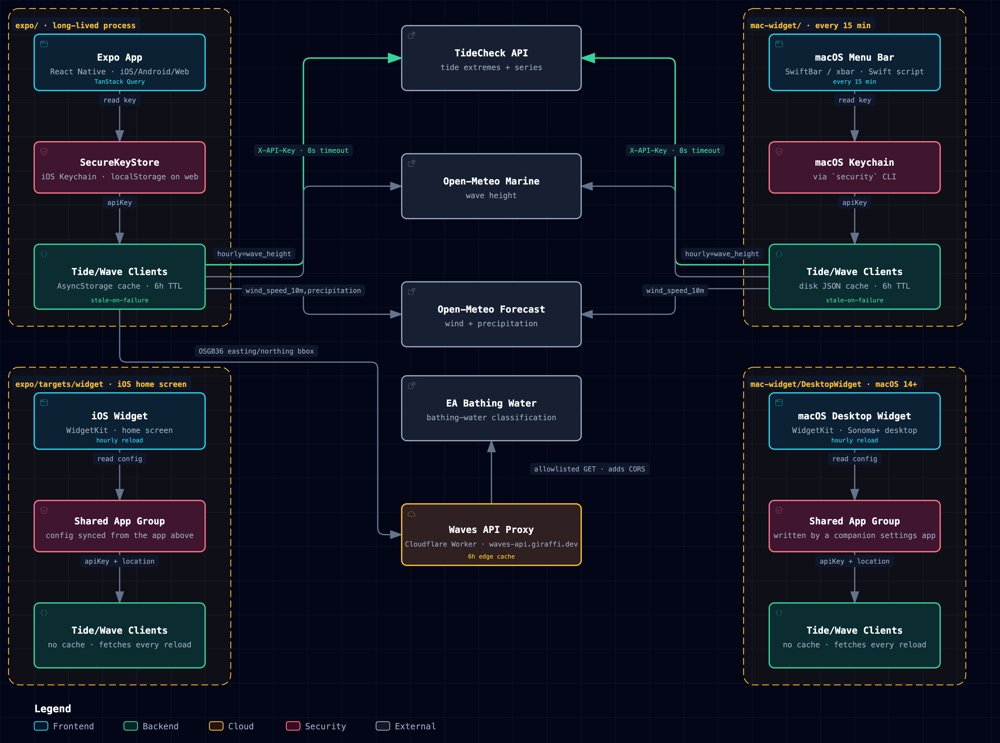
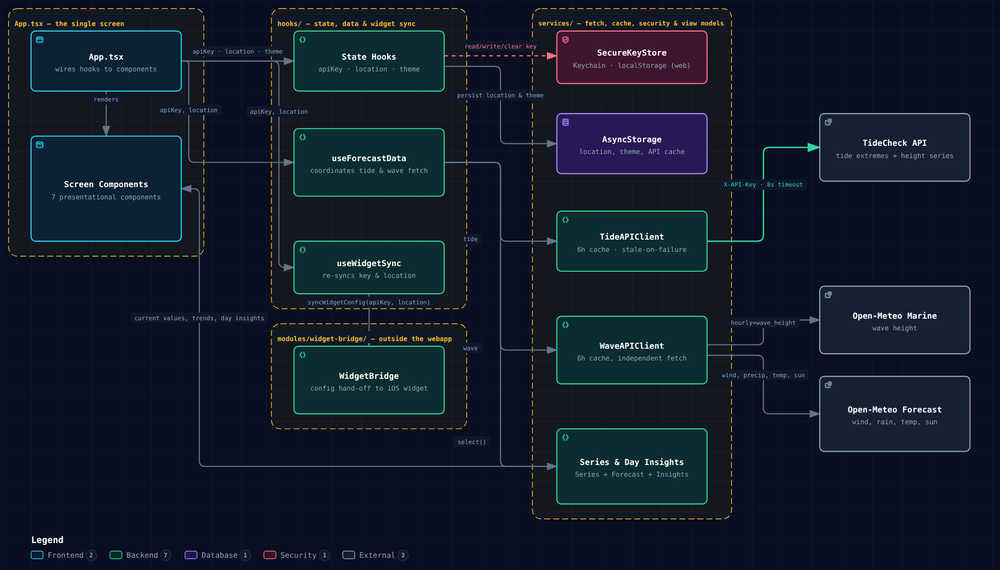

# Architecture

Tide, wave and wind conditions for Hastings Pier, shipped as **four independent
clients** — a React Native app (`expo/`), an iOS home-screen widget
(`expo/targets/widget/`), a macOS menu-bar script (`mac-widget/`), and a macOS
desktop widget (`mac-widget/DesktopWidget/`) — that read from the same two
external APIs but share no fetch/parse code between them. There's no shared
package: every difference below is a separate, hand-written implementation of
the same shape.

**Contents**

- [System map](#system-map)
- [What's identical, what's duplicated](#whats-identical-whats-duplicated)
- [Cold-start request lifecycle](#cold-start-request-lifecycle)
- [Inside the Expo app](#inside-the-expo-app)
- [The two widgets](#the-two-widgets)
- [Notes](#notes)

## System map

All four clients run roughly the same shape — read a key, fetch tide extremes
plus wave/wind, then either cache for six hours (the app and the xbar script)
or just fetch fresh each time (the two widgets, since WidgetKit already
throttles reloads) — against the same TideCheck and Open-Meteo endpoints.
Nothing below that shape is shared: each client has its own key store and its
own fetch client.

An interactive version — pan/zoom, theme toggle, guided views for the tide
path, the wave/wind calls, where each key lives, and how the app hands
config to its widget — is in
[`docs/architecture/waves.architecture.html`](architecture/waves.architecture.html)
(open it locally; the typed source is
[`waves.architecture.json`](architecture/waves.architecture.json)).

All four clients issue their requests independently — none shares a network
layer, a cache, or an in-flight-request lock with any other.

## What's identical, what's duplicated

| Aspect | Expo App | iOS Widget | macOS Menu Bar | macOS Desktop Widget |
| --- | --- | --- | --- | --- |
| **Runtime** | React Native (Hermes), one long-lived process | WidgetKit extension, reloaded roughly hourly | Swift script, re-invoked from scratch every 15 min | WidgetKit extension, reloaded roughly hourly |
| **Locations** | Multiple, user-togglable, persisted in AsyncStorage | One, whatever the app last synced | One, hardcoded (`hastings_pier-hgp-gbr-cco`) | One, set in its own settings app |
| **Charts** | Native SVG line/area charts (react-native-svg) | Native SwiftUI text/rows | ASCII bar rows in Menlo, 8 Unicode block levels | Native SwiftUI text/rows |
| **Cache** | AsyncStorage, 6h TTL, stale-on-failure | None — WidgetKit already throttles reloads | Disk JSON, 6h TTL, stale-on-failure | None — WidgetKit already throttles reloads |
| **Manual refresh** | Pull-to-refresh / footer button clears cache keys, refetches | N/A — reload on its own schedule, or when the app calls `reloadWidgets()` | xbar menu item `rm`'s the cache files, then `refresh=true` | N/A — reload on its own schedule, or when its settings app saves |
| **On fetch failure** | Serves the last cache, however stale | Shows a "couldn't load" placeholder | Serves the last cache, otherwise prints a red status line | Shows a "couldn't load" placeholder |

## Cold-start request lifecycle

What happens between opening the Expo app and seeing numbers on screen:

1. **Key and location hydrate.** `useApiKey` and `useLocation` both start
   `undefined` rather than defaulting early, so nothing fires a request for
   the wrong key or location while the stores are still being read.
2. **Two queries enable at once.** Once both resolve, `useForecastData` turns
   on a tide query keyed on `(stationId, apiKey)` and a wave query keyed on
   `(location.id)` — run in parallel via `useQueries`.
3. **Tide client checks its cache.** `TideAPIClient` reads AsyncStorage; a hit
   under six hours old returns immediately, otherwise it calls TideCheck with
   an 8s timeout and an `X-API-Key` header, then writes the new cache.
4. **Wave client does the same, against two calls.** `WaveAPIClient` hits
   Open-Meteo's Marine API for wave height, then — independently, so one
   outage can't take down the other — the Forecast API for wind and
   precipitation together.
5. **Results become interpolating series.** Raw points turn into
   `TideSeries` / `WaveSeries` / `WindSeries` / `PrecipitationSeries`, which
   answer "value right now" and "trend" by linear interpolation between the
   nearest samples.
6. **A silent background top-up.** If the cache hit that just landed was
   fetched over an hour ago, an effect quietly calls the cache-bypassing
   `refresh()` — the already-rendered screen never blocks on it.
7. **The widget gets synced.** `useWidgetSync` fires whenever the key or
   location changes, handing both to the iOS widget over a shared App Group
   (see below) and asking WidgetKit to reload.

## Inside the Expo app

The system map above treats each client as one "Tide/Wave Clients" box. Zooming
into just `expo/` — the webapp — shows the layers behind that box: `App.tsx`
wires a handful of hooks to seven presentational components; the hooks
(`useApiKey`, `useLocation`, `useTheme`, `useForecastData`, `useWidgetSync`)
own state and orchestrate fetching; and the services layer (the two API
clients, `SecureKeyStore`, `AsyncStorage`, and the interpolating Series +
`buildDayInsights()` view models) does the actual caching, fetching, and
computation, independent of any UI framework detail.

An interactive version — guided views for boot/state hydration, the tide+wave
fetch, cache-first resilience, and the app→widget hand-off — is in
[`docs/architecture/webapp.architecture.html`](architecture/webapp.architecture.html)
(open it locally; the typed source is
[`webapp.architecture.json`](architecture/webapp.architecture.json)).

## The two widgets

Neither widget can show a text field to ask for an API key, so each borrows
one from a companion process, then fetches and renders entirely on its own —
mirroring the xbar script's fetch/parse logic (`TideClock`, `ValueSeries`,
the TideCheck + Open-Meteo calls) rather than reusing it or the app's
already-fetched data.

- **iOS home-screen widget** (`expo/targets/widget/`) — built into the Expo
  app via [`@bacons/apple-targets`](https://github.com/EvanBacon/expo-apple-targets),
  added as a widget extension target during `expo prebuild`. It gets its
  config from the app: `expo/modules/widget-bridge/` is a local Expo Module
  that writes `{apiKey, stationId, latitude, longitude, locationName}` into a
  shared App Group whenever `useWidgetSync` fires, and calls
  `WidgetCenter.reloadAllTimelines()`. The widget's own `TimelineProvider`
  reads that config and fetches TideCheck/Open-Meteo itself on every reload.
  See [`expo/targets/widget/README.md`](../expo/targets/widget/README.md) for
  setup.
- **macOS desktop widget** (`mac-widget/DesktopWidget/`) — a real WidgetKit
  widget draggable onto the desktop (macOS 14 Sonoma+), distinct from the
  xbar menu-bar script. It ships as its own small SwiftUI settings app plus a
  widget extension, generated via [XcodeGen](https://github.com/yonaskolb/XcodeGen)
  from a checked-in `project.yml` rather than a hand-edited `.xcodeproj`. The
  settings app writes the API key and location to a shared App Group; the
  widget extension reads it and fetches independently, same as the iOS
  widget. See [`mac-widget/DesktopWidget/README.md`](../mac-widget/DesktopWidget/README.md)
  for setup.

Both widgets deliberately skip the disk cache the app and xbar script keep —
WidgetKit already throttles reloads to roughly hourly, so there's little for
a cache to save.

## Notes

- `expo/` — React Native, TanStack Query, expo-secure-store
- `expo/targets/widget/` — Swift/SwiftUI, WidgetKit, `@bacons/apple-targets`
- `mac-widget/` — Swift, xbar/SwiftBar plugin protocol
- `mac-widget/DesktopWidget/` — Swift/SwiftUI, WidgetKit, XcodeGen
- Upstream: tidecheck.com, open-meteo.com
- Timezone: Europe/London throughout
