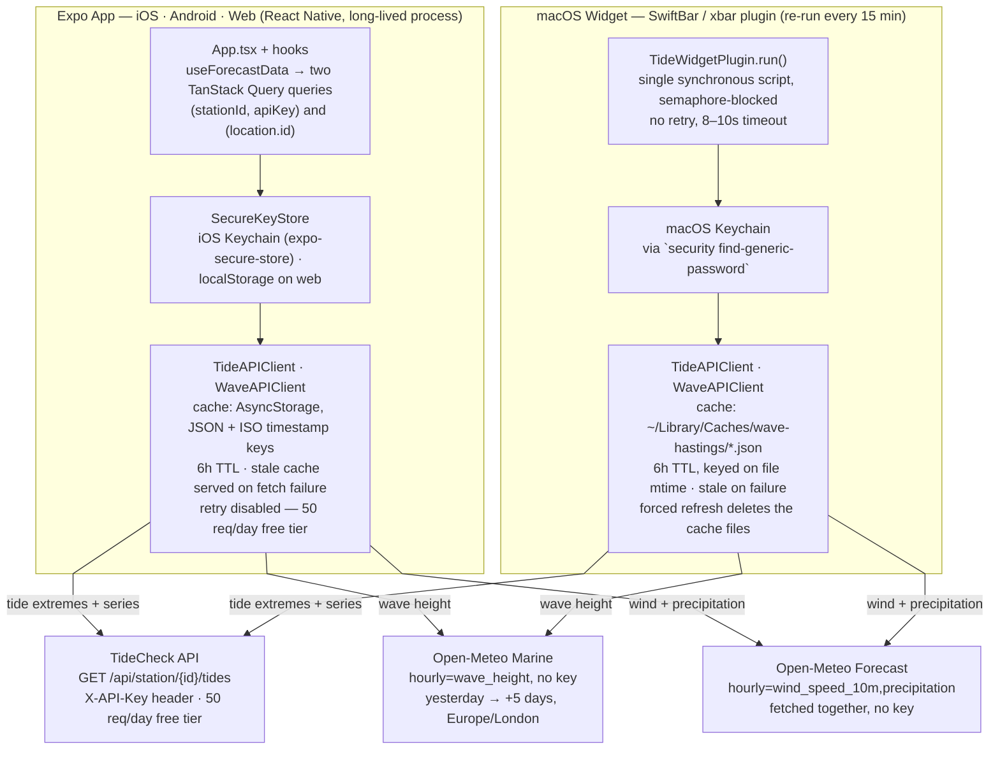

# Architecture

Tide, wave and wind conditions for Hastings Pier, shipped as **two independent
clients** — a React Native app (`expo/`) and a macOS menu-bar widget
(`mac-widget/`) — that read from the same two external APIs but share no code
between them. There's no shared package: every difference below is two
separate, hand-written implementations of the same shape.

**Contents**

- [System map](#system-map)
- [What's identical, what's duplicated](#whats-identical-whats-duplicated)
- [Cold-start request lifecycle](#cold-start-request-lifecycle)
- [Notes](#notes)

## System map

Both clients run the identical shape — read an API key, fetch tide extremes
plus wave/wind/precipitation, cache for six hours, fall back to a stale cache
on failure — against the same TideCheck and Open-Meteo endpoints. Nothing
below that shape is shared: each platform has its own key store, its own
cache format, and its own fetch client.

Both clients issue all three requests independently — neither shares a
network layer, a cache, or an in-flight-request lock with the other.

## What's identical, what's duplicated

| Aspect | Expo App | macOS Widget |
| --- | --- | --- |
| **Runtime** | React Native (Hermes), one long-lived process — state persists across renders via hooks | Swift script, re-invoked from scratch — xbar/SwiftBar re-runs it every 15 minutes |
| **Locations** | Multiple, user-togglable, persisted in AsyncStorage | One, hardcoded (`hastings_pier-hgp-gbr-cco`) |
| **Charts** | Native SVG line/area charts (react-native-svg) | ASCII bar rows in Menlo, 8 Unicode block levels |
| **Orchestration** | TanStack Query — dedupes, tracks fetch/error state, retry disabled | None — sequential calls, blocked on a semaphore |
| **Manual refresh** | Pull-to-refresh / footer button clears the AsyncStorage cache keys, refetches | xbar menu item `rm`'s the cache files, then `refresh=true` |
| **On fetch failure** | Serves the last cache, however stale — tide errors surface in the UI, wave/wind fail silently | Serves the last cache, however stale — otherwise prints a red status line |

## Cold-start request lifecycle

What happens between opening the Expo app and seeing numbers on screen:

1. **Key and location hydrate.** `useApiKey` and `useLocation` both start
   `undefined` rather than defaulting early, so nothing fires a request for
   the wrong key or location while the stores are still being read.
2. **Two queries enable at once.** Once both resolve, `useForecastData` turns
   on a tide query keyed on `(stationId, apiKey)` and a wave query keyed on
   `(location.id)` — run in parallel via `useQueries`.
3. **Tide client checks its cache.** `TideAPIClient` reads AsyncStorage; a hit
   under six hours old returns immediately, otherwise it calls TideCheck with
   an 8s timeout and an `X-API-Key` header, then writes the new cache.
4. **Wave client does the same, against two calls.** `WaveAPIClient` hits
   Open-Meteo's Marine API for wave height, then — independently, so one
   outage can't take down the other — the Forecast API for wind and
   precipitation together.
5. **Results become interpolating series.** Raw points turn into
   `TideSeries` / `WaveSeries` / `WindSeries` / `PrecipitationSeries`, which
   answer "value right now" and "trend" by linear interpolation between the
   nearest samples.
6. **A silent background top-up.** If the cache hit that just landed was
   fetched over an hour ago, an effect quietly calls the cache-bypassing
   `refresh()` — the already-rendered screen never blocks on it.

## Notes

- `expo/` — React Native, TanStack Query, expo-secure-store
- `mac-widget/` — Swift, xbar/SwiftBar plugin protocol
- Upstream: tidecheck.com, open-meteo.com
- Timezone: Europe/London throughout
